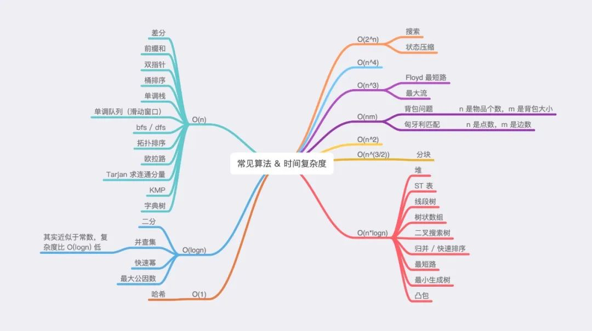

## 思路

众所周知，算法题主要有两大难点，一是「实现」，即算法本身的难度；二是「思路」，即你能否想到使用这个算法来解决题目。

对于有一定刷题基础的同学来说，力扣上大部分简单、中等题所涉及的算法都是非常常见的算法，即算法本身不存在难度，最大的难点在于「思路」，即如何想到适合本题的算法。

而解决「思路」问题，除了大量刷题积累经验之外，还可以采用一定的「巧劲」，从时间复杂度这个角度入手筛选出合适的算法。本节就是向大家介绍这种「巧劲」是如何在具体解题过程中发挥作用的。

#### 一、数据范围的隐含信息

如何确定一道题合适的时间复杂度？最简单、快捷的方式就是通过观察题目中的数据范围来确定。

不过你可能马上会反驳，力扣上并不是所有题目都有数据范围，那又该如何确定呢？不要急，没有数据范围也是可以采用这种方式来思考的，我们会在「练习」部分进行详细说明。

言归正传，如何通过数据范围来确定合适的时间复杂度呢？

通常来说，在力扣上，Python 可以支持到 10^7^的时间复杂度；C++ 会稍微多一点，大概 10^7^ ~ 10^8^ 之间。因此我们可以得到如下表所示的，数据范围与算法大致时间复杂度的对应表。

| 数据范围 | 时间复杂度 |
| -------- | ---------- |
| 20       | O(2^n^)    |
| 50       | O(n^4^)    |
| 200      | O(n^3^)    |
| 2000     | O(n^2^)    |
| 20000    | O(*nlogn*) |
| 50000    | O(n)       |


二、算法时间复杂度总结
通过数据范围得到时间复杂度后，我们需要对照下图筛选出适合的算法进行求解。



#### 此处有两点需要注意：

* 上图仅列出了时间复杂度较为固定的常见算法，而类似于动态规划、贪心、暴力等时间复杂度百变多样的算法并未列出。
* O(logn)O(logn) 的算法通常与 O(n)O(n) 的算法组合在一起，用于实现 O(nlogn)O(nlogn) 要求的题目。

## 类别

* 待定
  * 26
* 前缀和
  * 560、1248

* 排序
  * 56
* 滑动窗口
  * 3

## 3. 无重复字符的最长子串

[3. 无重复字符的最长子串](https://leetcode-cn.com/problems/longest-substring-without-repeating-characters/)

Longest_Substring_Without_Repeating_Characters

给定一个字符串，请你找出其中不含有重复字符的 **最长子串** 的长度。

#### 示例 1:

```
输入: s = "abcabcbb"
输出: 3 
解释: 因为无重复字符的最长子串是 "abc"，所以其长度为 3。
```

#### 示例 2:

```
输入: s = "bbbbb"
输出: 1
解释: 因为无重复字符的最长子串是 "b"，所以其长度为 1。
```

#### 示例 3:

```
输入: s = "pwwkew"
输出: 3
解释: 因为无重复字符的最长子串是 "wke"，所以其长度为 3。
     请注意，你的答案必须是 子串 的长度，"pwke" 是一个子序列，不是子串。
```

#### 示例 4:

```
输入: s = ""
输出: 0
```

#### 提示：

* `0 <= s.length <= 5 * 104`
* `s` 由英文字母、数字、符号和空格组成
* 注意`"abc"`，`" "`等样例

#### 题解：

O(n^2^)	暴力

```java
public int lengthOfLongestSubstringN2(String s) {
        if(Objects.isNull(s) || s.length() == 0){
            return 0;
        }
        Set<Character> set = new HashSet<Character>();
        int len = s.length();
        int maxLen = 0;
        for (int i = 0; i < len; i++) {
            int l = 1;
            set.add(s.charAt(i));
            for (int j = i + 1; j < len; j++) {
                if(set.contains(s.charAt(j))){
                    break;
                }else{
                    set.add(s.charAt(j));
                    l++;
                }
            }
            maxLen = Math.max(maxLen, l);
            set.clear();
        }
        return maxLen;
    }
```

##### O(n)

滑动窗空，本身使用Sat存储不重复的字符，为了减少左指针的无用递增，选择利用Map存储前面字符对应的位置，发现已存在时将左指针定位到原值与重复值较大的位置，每次更新结果长度和Map，做到只遍历一次

```java
public int lengthOfLongestSubstringN1(String s) {
        if (Objects.isNull(s) || s.length() == 0) {
            return 0;
        }
        Map<Character, Integer> map = new HashMap<>();
        int len = s.length();
        int l = 0, r = 0;
        int maxLen = 0;
        for(;r<len;r++){
            char c = s.charAt(r);
            if(map.containsKey(c)){
                l = Math.max(map.get(c)+1, l);
            }
            maxLen = Math.max(maxLen, r-l+1);
            map.put(c,r);
        }
        return maxLen;
    }
```


## 26. 删除有序数组中的重复项

[26. Remove Duplicates from Sorted Array](https://leetcode-cn.com/problems/remove-duplicates-from-sorted-array/)

[26. 删除有序数组中的重复项](https://leetcode-cn.com/problems/remove-duplicates-from-sorted-array/)

给你一个有序数组`nums`，请你 原地 删除重复出现的元素，使每个元素**只出现一次**，返回删除后数组的新长度。

不要使用额外的数组空间，你必须在**原地**修改输入数组 并在使用 O(1) 额外空间的条件下完成。

 

#### 说明:

为什么返回数值是整数，但输出的答案是数组呢?

请注意，输入数组是以「引用」方式传递的，这意味着在函数里修改输入数组对于调用者是可见的。

你可以想象内部操作如下:

```java
// nums 是以“引用”方式传递的。也就是说，不对实参做任何拷贝
int len = removeDuplicates(nums);

// 在函数里修改输入数组对于调用者是可见的。
// 根据你的函数返回的长度, 它会打印出数组中 该长度范围内 的所有元素。
for (int i = 0; i < len; i++) {
    print(nums[i]);
}
```

#### 示例 1：

```
输入：nums = [1,1,2]
输出：2, nums = [1,2]
解释：函数应该返回新的长度 2 ，并且原数组 nums 的前两个元素被修改为 1, 2 。不需要考虑数组中超出新长度后面的元素。
```

#### 示例 2：

```
输入：nums = [0,0,1,1,1,2,2,3,3,4]
输出：5, nums = [0,1,2,3,4]
解释：函数应该返回新的长度 5 ， 并且原数组 nums 的前五个元素被修改为 0, 1, 2, 3, 4 。不需要考虑数组中超出新长度后面的元素。
```

#### 提示：

```
0 <= nums.length <= 3 * 104
-104 <= nums[i] <= 104
nums 已按升序排列
```

#### 解题：

```java
class Solution {
    public int removeDuplicates(int[] nums) {
        if(nums==null||nums.length==0){
            return 0;
        }
        int len = nums.length;
        int fast = 0;
        int low = 0;
        while(fast<len){
            if(nums[fast]!=nums[low]){
                if(fast-low>1) {
                    nums[low+1] = nums[fast];
                }
                low++;
            }
            fast++;
        }
        return ++low;
    }
}
```

#### @ToDo

剪枝

## 56.合并区间

[56. 合并区间](https://leetcode-cn.com/problems/merge-intervals/)

Merge_Intervals

以数组 `intervals` 表示若干个区间的集合，其中单个区间为 `intervals[i] = [starti, endi]` 。请你合并所有重叠的区间，并返回一个不重叠的区间数组，该数组需恰好覆盖输入中的所有区间。

 

#### 示例 1：

```
输入：intervals = [[1,3],[2,6],[8,10],[15,18]]
输出：[[1,6],[8,10],[15,18]]
解释：区间 [1,3] 和 [2,6] 重叠, 将它们合并为 [1,6].
```

#### 示例 2：

```
输入：intervals = [[1,4],[4,5]]
输出：[[1,5]]
解释：区间 [1,4] 和 [4,5] 可被视为重叠区间。
```

#### 提示：

* `1 <= intervals.length <= 104`
* `intervals[i].length == 2`
* `0 <= starti <= endi <= 104`

#### 解题

```java
public int[][] merge(int[][] intervals) {
        if(Objects.isNull(intervals) || intervals.length == 0) {
            return new int[0][0];
        }
        Arrays.sort(intervals, Comparator.comparingInt(o -> o[0]));
        List<int[]> rtn = new ArrayList<>();
        int len = intervals.length;
        for (int[] interval : intervals) {
            int l = interval[0], r = interval[1];
            int size = rtn.size();
            if (size == 0 || rtn.get(size - 1)[1] < l) {
                rtn.add(new int[]{l, r});
            } else {
                rtn.get(size - 1)[1] = Math.max(r, rtn.get(size - 1)[1]);
            }
        }
        return rtn.toArray(new int[rtn.size()][]);
}
```


## 560. 和为K的子数组

[560. 和为K的子数组](https://leetcode-cn.com/problems/subarray-sum-equals-k/)

Subarray_Sum_Equals_K

给定一个整数数组和一个整数`k`，你需要找到该数组中和为 k 的连续的`子数组`的个数。

#### 示例 1 :

```
输入:nums = [1,1,1], k = 2
输出: 2 , [1,1] 与 [1,1] 为两种不同的情况。
```

#### 说明 :

```
数组的长度为 [1, 20,000]。
数组中元素的范围是 [-1000, 1000] ，且整数 k 的范围是 [-1e7, 1e7]。
```

#### 题解：

##### O(n^2^)	单纯前缀和

```java
class Solution {
    public int subarraySumN2(int[] nums, int k) {
        if(Objects.isNull(nums) || nums.length == 0) return 0;
        int len = nums.length;
        int count = 0;
        int[] sum = new int[len];

        //获得前缀和数组
        sum[0] = nums[0];
        for(int i = 1; i<len;i++){
            sum[i] = sum[i-1]+nums[i];
        }

        //遍历子数组
        for (int r = 0; r < len; r++) {
            for (int l = -1; l < r; l++) {
                int sub;
                if(l<0){
                    sub = sum[r];
                }else{
                    sub = sum[r]-sum[l];
                }
                if(sub == k){
                    count++;
                }
            }
        }
        return count;
    }
}
```

##### O(n)	前缀和+Map进行优化

```java
public int subarraySumN(int[] nums, int k) {
        if(Objects.isNull(nums) || nums.length == 0){
            return 0;
        }
        int len = nums.length;
        int[] sum = new int[len];
        int count = 0;
        Map<Integer, Integer> map = new HashMap<>();

        //置入前缀和为0的数量
        map.put(0,1);

        //计算sum数组
        sum[0] = nums[0];
        for (int i = 1; i < len; i++) {
            sum[i] = sum[i - 1]+nums[i];
        }

        //统计前缀和
        for (int i = 0; i < len; i++) {
            if(map.containsKey(sum[i]-k)){
                count+=map.get(sum[i]-k);
            }
            map.put(sum[i], map.getOrDefault(sum[i], 0)+1);
        }
        return count;
    }
```


## 1248. 统计优美子数组

[1248. 统计「优美子数组」](https://leetcode-cn.com/problems/count-number-of-nice-subarrays/)

Count_Number_of_Nice_Subarrays

给你一个整数数组`nums`和一个整数 k。

如果某个 连续 子数组中恰好有 k 个奇数数字，我们就认为这个子数组是「`优美子数组`」。

请返回这个数组中「`优美子数组`」的数目。

#### 示例 1：

```
输入：nums = [1,1,2,1,1], k = 3
输出：2
解释：包含 3 个奇数的子数组是 [1,1,2,1] 和 [1,2,1,1] 
```

#### 示例 2：

```
输入：nums = [2,4,6], k = 1
输出：0
解释：数列中不包含任何奇数，所以不存在优美子数组。
```
#### 示例 3：

```
输入：nums = [2,2,2,1,2,2,1,2,2,2], k = 2
输出：16
```

#### 提示：

```
1 <= nums.length <= 50000
1 <= nums[i] <= 10^5
1 <= k <= nums.length
```

#### 解题

##### O(n^2^)	单纯前缀和，超出时间

```java
public int numberOfSubarraysN2(int[] nums, int k) {
        if(Objects.isNull(nums)||nums.length==0){
            return 0;
        }
        int len = nums.length;
        int sum[] = new int[len];
        int count = 0;
        //生成sum数组
        if(isOdd(nums[0])){
            sum[0] = 1;
        }else{
            sum[0] = 0;
        }
        for (int i = 1; i < len; i++) {
            if(isOdd(nums[i])){
                sum[i] = sum[i-1]+1;
            }else {
                sum[i] = sum[i-1];
            }
        }
        //遍历sum数组判断
        for (int r = 0; r < len; r++) {
            for (int l = -1; l < r; l++) {
                int sub = 0;
                if(l<0){
                    sub = sum[r];
                }else{
                    sub = sum[r]-sum[l];
                }
                if(sub==k){
                    count++;
                }
            }
        }
        return count;
    }
```

##### O(n)	加入Map优化

```java
public int numberOfSubarraysN1(int[] nums, int k) {
        if (Objects.isNull(nums) || nums.length == 0) {
            return 0;
        }
        int len = nums.length;
        int sum[] = new int[len];
        int count = 0;
        Map<Integer, Integer> map = new HashMap<>();
        //生成sum数组
        if (isOdd(nums[0])) {
            sum[0] = 1;
        } else {
            sum[0] = 0;
        }
        for (int i = 1; i < len; i++) {
            if (isOdd(nums[i])) {
                sum[i] = sum[i - 1] + 1;
            } else {
                sum[i] = sum[i - 1];
            }
        }
        map.put(0,1);
        //遍历sum数组判断
        for (int i = 0; i < len; i++) {
            if(map.containsKey(sum[i] - k)){
                count+= map.get(sum[i]-k);
            }
            map.put(sum[i], map.getOrDefault(sum[i],0)+1);
        }
        return count;
    }
```

* 
